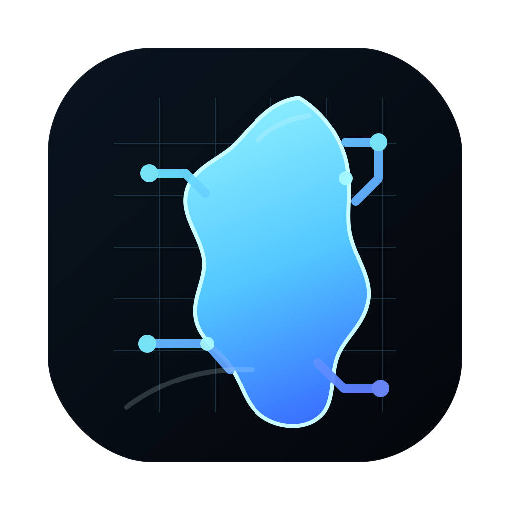

# Open Island

<p align="center">
  
</p>

<h1 align="center">Open Island</h1>

<p align="center">
  <strong>Bring local AI agents out of terminal black boxes and onto your desktop.</strong>
  <br>
  A local-first, native macOS control island for Claude Code, Codex, and terminal-native agent workflows.
  <br><br>
  <strong>English</strong> | <a href="README.zh-CN.md">简体中文</a>
</p>

<p align="center">
  <a href="https://www.apple.com/macos/"></a>
  <a href="https://www.swift.org/"></a>
  <a href="https://nodejs.org/"></a>
  <a href="LICENSE"></a>
  <a href="#status"></a>
</p>

<p align="center">
  <a href="#quick-start">Quick Start</a> ·
  <a href="#showcase">Showcase</a> ·
  <a href="#how-it-works">How It Works</a> ·
  <a href="#development">Development</a>
</p>

<p align="center">
  
</p>

---

## What is Open Island?

Open Island is a lightweight macOS app that gives local AI coding agents a desktop-level control surface. It sits near the notch or top bar, watches local agent activity through a Unix socket bridge, and shows the state that normally gets buried inside terminals: running sessions, waiting prompts, permission approvals, and the exact place you need to jump back to.

It does not replace Claude Code, Codex, or your terminal. It adds the missing ambient layer around them: visible, controllable, and local.

## Why This Exists

Developers are moving from "asking a chatbot" to delegating real work to local CLI agents. A typical day can include one terminal running a frontend task, another running tests, and an IDE terminal waiting for a permission decision.

That workflow creates three recurring problems:

- **State disappears**: active, waiting, completed, and failed sessions are scattered across terminal tabs and IDE panels.
- **Permission prompts block silently**: an agent can sit idle for minutes because the approval prompt is hidden behind another window.
- **Context gets lost**: when something needs intervention, you still have to hunt through terminal windows to find the right session.

Open Island pulls those signals out of the terminal layer and makes them visible without taking over your workspace.

## Core Capabilities

- **Ambient visibility**: collect local Claude Code, Codex, and Qoder sessions into one notch-style panel, with clear running, waiting, completed, and error states.
- **Desktop-level approval**: surface supported permission requests directly in the panel, so you can approve or deny without breaking out of the current IDE context.
- **Instant context jump**: click a session card to return to the owning Terminal, iTerm, Ghostty, Warp, VS Code, Cursor, or supported IDE route instead of manually searching for the right window.
- **Local-first bridge**: use a small Node.js Unix socket bridge and native macOS UI; no cloud relay, account, or remote telemetry is required.
- **Workflow-preserving design**: keep using your existing `claude`, `codex`, terminal, and IDE habits. Open Island observes and coordinates; it does not force a new command center.

## Showcase

### Main UI


The notch panel shows multiple active sessions and their latest state at a glance.

### Permission Approval Flow


Permission requests can be captured, displayed, and acted on from the desktop panel.

### Terminal / JetBrains Routing Overview


Local shells and IDE sessions send hook events into the bridge, while the panel gives you a return path to the right workspace.

## Supported Workflows

Primary agent support today:

- Claude Code
- Codex
- Qoder CLI

Current jump coverage:

- Terminal
- iTerm
- Ghostty
- Warp
- VS Code
- Cursor
- JetBrains IDEs, with known edge cases for embedded terminals and same-project multi-window routing

The architecture is intentionally small and extensible: agent hooks and bridge events are separate from the SwiftUI/AppKit panel, so more local agent integrations can be added without changing the core product shape. The current first-class workflow is centered on Claude Code, Codex, and Qoder on local macOS workflows.

## Status

Open Island is an early preview. The core loop is already usable for local macOS workflows centered on Terminal, iTerm, Claude Code, and Codex: session monitoring, panel rendering, supported permission surfacing, and basic jump behavior are in place.

What works well today:

- Personal local developer workflows
- Bridge communication and panel rendering
- Supported permission request flows
- Terminal and iTerm jump behavior
- VS Code and Cursor workspace jump
- Codex default hook install and session de-duplication
- Qoder session monitoring

Current boundaries:

- JetBrains embedded terminal routing still has edge cases
- Same-project multi-window JetBrains routing is not consistently precise
- Ghostty and Warp jump are still best-effort first versions
- Some interactions depend on macOS Accessibility and AppleScript stability

Near-term focus:

- Improve JetBrains routing and reduce multi-window misses
- Harden permission and jump behavior
- Add more tests and packaging polish

## Quick Start

### Requirements

- macOS 13 or later
- Node.js available in `PATH`
- Swift 5.9 or Xcode command line tools
- Accessibility permission enabled for reliable jump and automation behavior

### Install local hooks and launcher

```bash
./scripts/install-hooks.sh
```

This installs Claude, Qoder, and Codex hooks, the Codex wrapper, and the `open-island` launcher.

Then use:

```bash
open-island start
open-island stop
open-island restart
open-island status
```

If `open-island` is not found in the current shell:

```bash
export PATH="$HOME/.local/bin:$PATH"
```

On first run, open:

```text
System Settings -> Privacy & Security -> Accessibility
```

Allow the terminal or app you use to launch Open Island. Without this permission, the panel may still render, but jump and automation behavior can fail.

## How It Works

```text
Claude Code / Codex / local shell
  -> hook or wrapper event
Node.js bridge
  -> local Unix socket
SwiftUI + AppKit notch panel
  -> visible state, approval controls, jump action
Terminal / iTerm / IDE
```

The bridge is local-only. If Open Island is not running, the agent workflow should continue normally; hooks are designed to be a lightweight observation layer rather than a hard dependency.

## Packaged Builds

For distribution builds:

- Build a DMG locally with `bash scripts/package-dmg.sh <version>`
- Publish the resulting DMG as a GitHub Release asset
- Current DMG builds are unsigned developer-preview builds unless signing and notarization are added

See:

- [Unsigned macOS install guide](./docs/unsigned-macos-install.md)
- [Release checklist](./docs/release-checklist.md)
- [Changelog](./CHANGELOG.md)

## Development

Run the bridge:

```bash
cd bridge
npm install
npm start
```

Run the native app:

```bash
cd native/NotchMonitor
swift build
swift run NotchMonitor
```

If you change hook, wrapper, or jump behavior, restart the app before retesting:

```bash
open-island stop
open-island start
```

## Usage

1. Start Open Island with `open-island start`
2. Launch Claude Code, Codex, or Qoder normally
3. Watch live sessions appear in the notch panel
4. Click a session to jump back to its terminal or IDE
5. Use the panel to review supported permission prompts

## Recent Work

- Codex hooks are installed by default
- Codex permission hooks were updated for current CLI compatibility
- Codex auxiliary process/session de-duplication was tightened
- stale session cleanup and permission-request queueing were added to the bridge
- bootstrap diagnostics can now attempt limited self-heal
- iTerm/tmux jump was reworked toward session-first behavior
- VS Code/Cursor jump now prefers workspace reopen via the editor CLI
- Qoder hooks and session monitoring were added

## Project Structure

```text
open-island/
├── native/                    # SwiftUI macOS app
│   └── NotchMonitor/
│       ├── Package.swift
│       └── Sources/
│           ├── NotchMonitorApp.swift
│           ├── Models/
│           ├── Views/
│           └── Services/
├── bridge/                    # Node.js socket bridge and hooks
│   ├── server.js
│   ├── hook.js
│   └── codex-wrapper.js
├── scripts/
│   └── install-hooks.sh
└── docs/
    └── implementation notes and design docs
```

## Troubleshooting

### `open-island: command not found`

Add `~/.local/bin` to your `PATH`, or run:

```bash
~/.local/bin/open-island start
```

### Swift build fails after renaming or moving the repo

Swift module cache paths can become stale. Run:

```bash
cd native/NotchMonitor
swift package clean
swift build
```

### Jump works for Terminal but not for an IDE

Check:

- Open Island is running
- The bridge is up
- Accessibility permission is enabled

Then inspect logs:

```bash
tail -n 200 /tmp/notch-monitor-jump.log
tail -n 200 /tmp/notch-monitor-hook.log
tail -n 200 /tmp/notch-monitor-codex-wrapper.log
```

### JetBrains opens the right IDE but not the exact window

This is a known limitation in the current early-preview build. Open Island can usually activate the correct JetBrains app and often the right project window, but same-project multi-window routing is still not consistently precise.

## FAQ

### Does this work outside macOS?

No. The app depends on macOS UI automation, menu bar APIs, and local Unix-domain workflow assumptions.

### Does it support remote agents or cloud-hosted sessions?

Not today. The current design is for local developer workflows on one Mac.

### Does Open Island upload my agent activity?

No. The current bridge is local-only and communicates over a local Unix socket.
