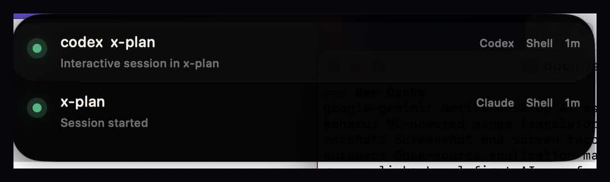
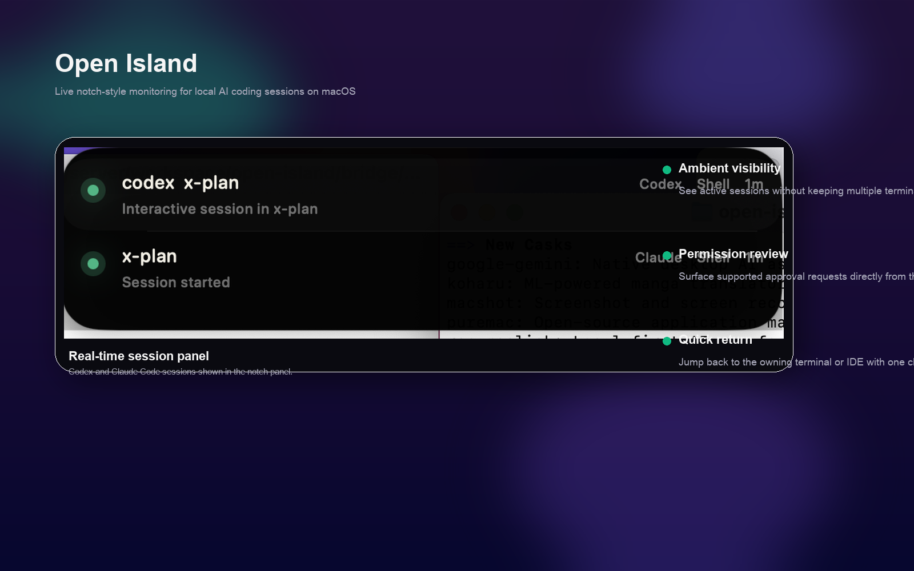
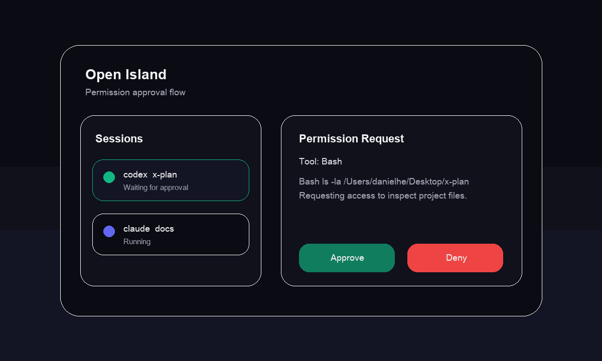
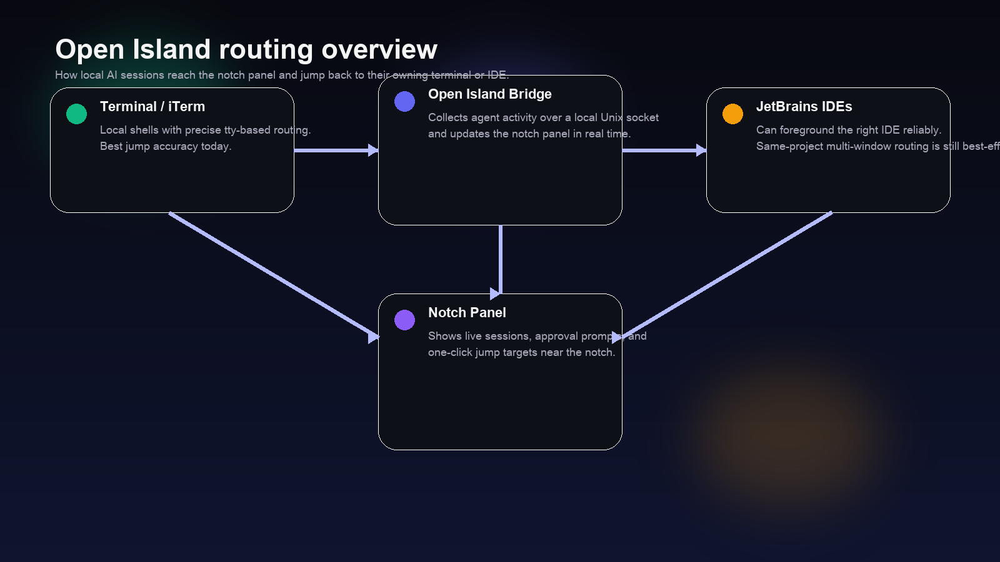

# Open Island

Ambient notch-style monitoring for local AI coding sessions on macOS.

[](https://www.apple.com/macos/)
[](https://www.swift.org/)
[](https://nodejs.org/)
[](./LICENSE)
[](#status)

Open Island is a macOS menu bar app for people who run multiple local coding agents and want an ambient view of what is active, waiting, or asking for attention. It listens to local agent activity through a Unix socket bridge, renders session state near the notch, surfaces supported permission requests, and lets you jump back to the owning terminal or IDE.

## Highlights

- Live session status for Claude Code and Codex
- Permission prompts surfaced in the panel
- One-click jump back to the owning terminal or IDE
- Lightweight local macOS app with a small bridge process

## Showcase

### Main UI

Real screenshot from the current app:



This is the current notch panel UI showing multiple active sessions and their latest state.

### Branded Hero



A polished hero-style asset for the GitHub landing section, useful for social cards and project summaries.

### Permission Approval Flow



Illustrates the intended approval flow: detect a permission request, surface it in the panel, and act on it without hunting through terminal windows.

### Terminal / JetBrains Routing Overview



High-level diagram showing how local Terminal / iTerm / JetBrains sessions reach the bridge and return to the notch panel.

Packaging:

- build a DMG locally with `bash scripts/package-dmg.sh <version>`
- publish the resulting DMG as a GitHub Release asset
- current DMG builds are unsigned developer-preview builds unless signing/notarization is added

## Why This Exists

CLI coding agents are powerful, but once you have multiple sessions across Terminal, iTerm, Claude Code, Codex, and IDE terminals, it becomes hard to track what is running and where attention is needed. Open Island turns that activity into a lightweight ambient UI that stays visible while you work.

## Supported Tools

Primary support today:

- Claude Code
- Codex

The codebase leaves room for more local agent integrations, but the current first-class workflow is centered on Claude Code and Codex.

## Status

Open Island is already usable for local macOS workflows centered on Terminal, iTerm, Claude Code, and Codex. It is still an early preview, but the core loop is in place: session monitoring, panel rendering, permission surfacing, and basic jump behavior are working.

What works well today:

- personal and local developer workflows
- bridge, panel rendering, and supported permission flows
- terminal and iTerm jump behavior

Current rough edges:

- JetBrains embedded terminal routing still has edge cases
- same-project multi-window JetBrains routing is not consistently precise
- some interactions depend on Accessibility and AppleScript stability

Near-term focus:

- improve JetBrains routing and reduce multi-window misses
- harden permission and jump behavior
- add more tests and packaging polish

## Requirements

- macOS 13 or later
- Node.js available in `PATH`
- Swift 5.9 or Xcode command line tools
- Accessibility permission enabled for reliable jump and automation behavior

## Installation

### Quick Start

Install the launcher and local hooks:

```bash
./scripts/install-hooks.sh
```

Then use:

```bash
open-island start
open-island stop
open-island restart
open-island status
```

If `open-island` is not found in the current shell:

```bash
export PATH="$HOME/.local/bin:$PATH"
```

If you are distributing the packaged app to users, see:

- [Unsigned macOS install guide](./docs/unsigned-macos-install.md)
- [Release checklist](./docs/release-checklist.md)
- [Changelog](./CHANGELOG.md)

### Development Startup

Run the bridge:

```bash
cd bridge
npm install
npm start
```

Run the native app:

```bash
cd native/NotchMonitor
swift build
swift run NotchMonitor
```

## First Run Setup

Open Island depends on macOS Accessibility for window activation, terminal jump, and approval interactions.

On first run, check:

- System Settings -> Privacy & Security -> Accessibility
- Allow the terminal or app you use to launch Open Island

Without this permission, the panel may still render, but jump and automation behavior can fail.

## Usage

1. Start Open Island with `open-island start`
2. Launch Claude Code or Codex normally
3. Watch live sessions appear in the notch panel
4. Click a session to jump back to its terminal or IDE
5. Use the panel to review supported permission prompts

## Project Structure

```text
open-island/
├── native/                    # SwiftUI macOS app
│   └── NotchMonitor/
│       ├── Package.swift
│       └── Sources/
│           ├── NotchMonitorApp.swift
│           ├── Models/
│           ├── Views/
│           └── Services/
├── bridge/                    # Node.js socket bridge and hooks
│   ├── server.js
│   ├── hook.js
│   └── codex-wrapper.js
├── scripts/
│   └── install-hooks.sh
└── docs/
    └── implementation notes and design docs
```

## Development

Common commands:

```bash
cd bridge && npm install
cd bridge && npm start
cd bridge && npm run dev

cd native/NotchMonitor && swift build
cd native/NotchMonitor && swift run NotchMonitor
```

If you change hook, wrapper, or jump behavior, restart the app before retesting:

```bash
open-island stop
open-island start
```

## Troubleshooting

### `open-island: command not found`

Add `~/.local/bin` to your `PATH`, or run:

```bash
~/.local/bin/open-island start
```

### Swift build fails after renaming or moving the repo

Swift module cache paths can become stale. Run:

```bash
cd native/NotchMonitor
swift package clean
swift build
```

### Jump works for Terminal but not for an IDE

Check:

- Open Island is running
- the bridge is up
- Accessibility permission is enabled

Then inspect logs:

```bash
tail -n 200 /tmp/notch-monitor-jump.log
tail -n 200 /tmp/notch-monitor-hook.log
tail -n 200 /tmp/notch-monitor-codex-wrapper.log
```

### JetBrains opens the right IDE but not the exact window

This is a known limitation in the current early-preview build. Open Island can usually activate the correct JetBrains app and often the right project window, but same-project multi-window routing is still not consistently precise.

## FAQ

### Does this work outside macOS?

No. The app depends on macOS UI automation, menu bar APIs, and Unix-domain local tooling assumptions.

### Does it support remote agents or cloud-hosted sessions?

Not today. The current design is for local developer workflows on one Mac.

### Why is JetBrains jump behavior less reliable than Terminal or iTerm?

JetBrains exposes less stable UI automation surface area than Terminal and iTerm. Open Island can usually bring the correct IDE to the foreground, but precise same-project multi-window routing is still limited.

### Does it support Codex out of the box?

Yes. The installer creates a local wrapper for Codex so Open Island can observe sessions without changing your normal command.

## Logs

Useful debug logs:

- `/tmp/notch-monitor-jump.log`
- `/tmp/notch-monitor-hook.log`
- `/tmp/notch-monitor-codex-wrapper.log`

## Contributing

Issues and PRs are welcome.

Recommended local validation before sending a change:

- `cd native/NotchMonitor && swift build`
- `cd bridge && npm install`
- manually verify bridge startup, panel rendering, permission prompts, and jump behavior

## License

MIT
